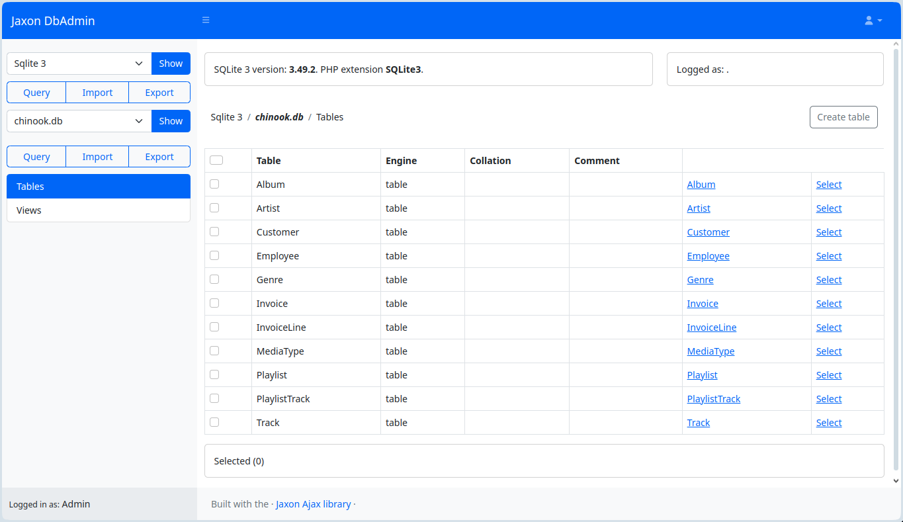

# A web-based database management tool

**Jaxon DbAdmin is a database admin dashboard with multiple DBMS support, and a custom and extensible authentication system**

[Installation](#installation) • [Docker](#running-with-docker) • [Authentication](#user-management-and-authentication) • [Configuration](#database-access-configuration) • [Features](#features-and-current-status)



---

## About Jaxon DbAdmin

Jaxon DbAdmin is built with [Jaxon](https://www.jaxon-php.org), [Laravel](https://laravel.com) and [Bootstrap 5](https://getbootstrap.com/docs/5.0/getting-started/introduction).

It currently supports 3 database servers: PostgreSQL, MySQL (and MariaDB), and SQLite.

Unlike other database management tools, Jaxon DbAdmin uses the Laravel authentication system instead the database servers credentials to authenticate the application users.

## Installation

As a Laravel and PHP application, Jaxon DbAdmin needs to be installed with Composer.

Install from Packagist.

```bash
composer create-project lagdo/dbadmin-app dbadmin
```

Install from Github.

```bash
git clone https://github.com/lagdo/dbadmin-app dbadmin
cd dbadmin
composer install
composer run post-root-package-install
composer run post-create-project-cmd
```

By default, an SQLite database located in the `database/database.sqlite` subdir will be created and migrated.
A different database can be used. In this case, the `.env` and `config/database.php` file must be updated accordingly. See the Laravel [database documention](https://laravel.com/docs/12.x/database) for more information.

Finally, a web server must be configured to give access to the application directory, with the `public` subdir as index.

## Running with Docker

The Jaxon DbAdmin application can also be started with Docker.

```bash
docker run --rm --publish 8080:8080 --volume ./config/dbadmin.json:/var/www/config/dbadmin.json lagdo/jaxon-dbadmin:latest
```

or

```bash
docker run --rm -p 8080:8080 -v ./config/dbadmin.json:/var/www/config/dbadmin.json lagdo/jaxon-dbadmin:latest
```

In a `docker-compose.yml` file.

```yaml
  dbadmin:
    container_name: dbadmin
    image: lagdo/jaxon-dbadmin:latest
    volumes:
      - ./config/dbadmin.json:/var/www/config/dbadmin.json
    ports:
      - 8080:8080
```

The content of the `config/dbadmin.json` config file is described in the [Database access configuration](#database-access-configuration) above.

## User management and authentication

Unlike other database management tools, Jaxon DbAdmin does not use the database servers credentials to authenticate the application users.

The user authentication is a separate process, which here is provided by the [Laravel framework](https://laravel.com/docs/12.x/authentication).

By default, the user accounts and credentials are stored in the application database (different from the managed databases), and by default a fresh Laravel installation will create and migrate an SQLite database located in the `database/database.sqlite`.
The application database can be changed in the [Laravel database configuration](https://laravel.com/docs/12.x/database).

Jaxon DbAdmin provides a CLI command to create user accounts.
It is executed from the application install dir.

```bash
php artisan user:create --name <user name> --email <user email>
```

If the `--name` and `--email` are not provided, the CLI command will ask for them.
It will then ask to provide and confirm the user password, and if all the inputs are valid, the user account will be created.

Thanks to Laravel, more advanced authentication mechanisms can be implemented quite easily.
For example, Jaxon DbAdmin can be setup to authenticate its users on a company SSO service.

## Database access configuration

Jaxon DbAdmin supports 3 file formats for its database access configuration options: `json`, `yaml` and `php`.

It will successively look for the `config/dbadmin.json`, `config/dbadmin.yaml`, `config/dbadmin.yml` and `config/dbadmin.php`, and loads the first it will find.
It will then parse the content of the config file, and return the authenticated user specific options.

This is an example of a `json` config file.

```json
{
    "common": {
        "access": {
            "server": false,
            "system": false
        },
        "servers": {
            "db-postgresql": {
                "driver": "pgsql",
                "name": "PostgreSQL 14",
                "host": "env(DBA_PGSQL_HOST)",
                "port": "env(DBA_PGSQL_PORT)"
            },
            "db-mariadb": {
                "driver": "mysql",
                "name": "MariaDB 10",
                "host": "env(DBA_MARIA_HOST)",
                "port": "env(DBA_MARIA_PORT)"
            },
            "db-mysql": {
                "driver": "mysql",
                "name": "MySQL 8",
                "host": "env(DBA_MYSQL_HOST)",
                "port": "env(DBA_MYSQL_PORT)"
            }
        }
    },
    "fallback": {},
    "users": [{
        "id": {
            "users": [
                "user1@company.com",
                "user2@company.com"
            ]
        },
        "servers": {
            "db-postgresql": {
                "username": "env(DBA_PGSQL_USERNAME)",
                "password": "env(DBA_PGSQL_PASSWORD)"
            },
            "db-mysql": {
                "username": "env(DBA_MYSQL_USERNAME)",
                "password": "env(DBA_MYSQL_PASSWORD)"
            },
            "laravel": {
                "driver": "sqlite",
                "name": "Laravel",
                "directory": "env(SQLITE_LARAVEL_DIR)"
            }
        }
    }, {
        "id": {
            "user": "admin@company.com"
        },
        "access": {
            "server": true,
            "system": true
        },
        "servers": {
            "db-mariadb": {
                "username": "env(DBA_MARIA_USERNAME)",
                "password": "env(DBA_MARIA_PASSWORD)"
            },
            "db-mysql": {
                "username": "env(DBA_MYSQL_USERNAME)",
                "password": "env(DBA_MYSQL_PASSWORD)"
            },
            "sqlite-3": {
                "driver": "sqlite",
                "name": "Sqlite 3",
                "directory": "env(SQLITE_DEFAULT_DIR)"
            }
        }
    }]
}
```

The Jaxon DbAdmin config file can contain 3 sections, all of which are optional.

#### The `common` section

This section contains options that are shared for all users.
The options in this section will be merged with the user options found.
Which also means that if no entry is found for the user, these options are not returned.

#### The `fallback` section

The options in this section will be returned if no specific entry exists for the authenticated user in the `users` section.

These options will be merged with the `common` options.

#### The `users` section

This section must provide an array of options, each for a given user or group of users.

Each entry in the array must have an attribute with `id` key, which itself is an object with 4 possible attributes to identify the corresponding users:
- `user`: a single user email.
- `users`: an array of user emails.
- `role`: a single user role.
- `roles`: an array of user roles.

The other attributes are the database options, described in the following paragraph.

## The database options

The `common`, `fallback` and each entry in `users` array can contain the same options.

### The `servers` option

The `servers` option lists the database servers to be managed.

For each entry, the key is the unique identifier used in requests to the Jaxon DbAdmin application.
The `driver` option indicate the corresponding DBMS: `pgsql` for PostgreSQL, `mysql` for MySQL or MariaDB, and `sqlite` for SQLite.
The `name` option is the name to be displayed in the application UI.

The other options depend on the DBMS.

For SQLite, the `directory` option is a directory where to look for database files.
Each file in the directory with the `db`, `sdb` or `sqlite` is listed as a database.

For the others, the `host`, `port`, `username` and `password` options will be used to connect to the database server. The `port` option is the only optional value.

Except for `driver` and `name`, the values for all the other options can be load from env vars.
The option need to be set in a specific format like `env(DBA_PGSQL_HOST)`, where the value in the parenthesis is the env var name.

After the merge with the options in the `common` section, the entries in the `servers` options are filtered on valid values.
As a consequence, only the entries for which all the required options (except `port`) are provided will be returned in the final list.

### The `default` option

The `default` option defines a server the application will connect to right after user login.

### The `access` option

The `access` option is an object which contains multiple options which define to which databases and to which part of the application the user will have access.

The `access` option can be defined at top level, in this case it applies to all the database servers, or it can be defined in a specific server options, to be applied only to that server.

In the `access` object, the `system` option defines if the user has access to system databases and schemas. If set to `false`, which is the default, the system databases will not be listed in the user account.

The `server` option defines if the user has access to server specific pages. If set to `false`, which is the default, the user will not have access to the `Databases`, `Process list` and `Variables` pages, as well as the server-related `Query`, `Import` and `Export` pages.

The `databases` and `schemas` options restrict the user access to the listed databases and schemas.

## Features and current status

This application and the related packages are still being actively developed, and the provided features are still basic and need improvements.

The following features are currently available:
- Browse servers and databases.
- Show tables and views details.
- Query a table.
- Execute queries in the query editor.

The following features are either disabled or unavailable:
- Query a view.
- Save queries in user account.
- Save and show the query history.
- Navigate through related tables.
- Create, alter or drop a database, table or view.
- Insert, modify or delete data from a table.
- Import or export data.

## Contributing

If you're interested in helping improve this project, contributions are very welcome:

- **Bug reports**: If something doesn't work as expected
- **Feature suggestions**: Ideas for improvements
- **Code contributions**: Help fix issues or add features
- **Documentation**: Help make things clearer for others
- **Testing**: Help identify problems

Feel free to open issues or pull requests. Even small improvements are appreciated.

## Technical Details

- **Backend**: Laravel (PHP), [Jaxon](https://www.jaxon-php.org)
- **Frontend**: Bootstrap, Blade, [UI Builder](https://github.com/lagdo/ui-builder)
- **Containerization**: Docker support included

The Jaxon DbAdmin application is actually the integration of the [Jaxon DbAdmin package](https://github.com/lagdo/jaxon-dbadmin), which is an [extension of the Jaxon library](https://www.jaxon-php.org/docs/v5x/extensions/packages.html), with the Laravel framework, using the [Laravel integration extension](https://github.com/jaxon-php/jaxon-laravel).

The UI is built with the [HTML UI Builder](https://github.com/lagdo/ui-builder) package, and generated with the [Bootstrap 5 HTML UI Builder](https://github.com/lagdo/ui-builder-bootstrap5) adapter package.

The database access code (and thus the provided features) originates from [Adminer](https://github.com/vrana/adminer).
The original code was separated into multiple Composer packages, and refactored to take advantage of the latest PHP features: namespaces, interfaces, dependency injection, and so on.

## License

BSD 3-Clause License - feel free to use, modify, and distribute.
